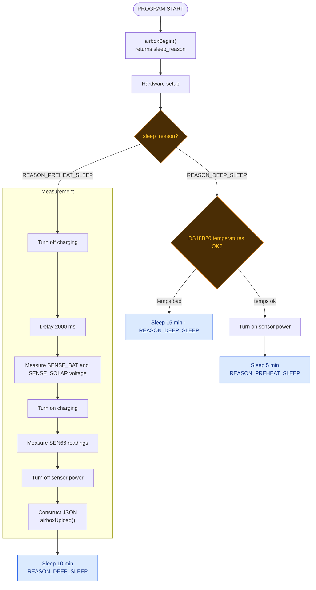

# `airbox_net.h` — the networking / sleep "black box"

This module holds everything pupils do **not** need to read or edit to work on
the station: WiFi connection management, the HTTPS upload to our server, deep
sleep with the sleep-reason mechanism, NVS credential storage, the setup-mode
hotspot, and the boot housekeeping (sensor-rail restore, setup button, USB
serial console). The sketch (`firmware.ino`) only ever calls the small API
below; everything else in the header is internal plumbing.

To include it, add at the beginning of the sketch:

```cpp
#include "airbox_net.h"
```

Include it exactly **once**, from the sketch — it *defines* its functions, so
a second include in another `.cpp` would duplicate them.

## The API at a glance

| Function | Call it | One-liner |
|---|---|---|
| `int airboxBegin()` | **first** line of `setup()` | Boot housekeeping; returns the previous sleep's reason code, `-1` on a fresh boot |
| `void airboxBeginConnect()` | before you need the network | Start WiFi associating in the background; returns immediately |
| `bool airboxWaitConnected(uint32_t millisecondsTimeout)` | before uploading | Block until WiFi is connected or the timer is up |
| `bool airboxUpload(const char* json)` | after the payload is built | Ping + HTTPS POST the JSON C string, then power the radio down |
| `void airboxSleep(uint32_t sleepDurationMs, int sleepReason)` | end of every cycle path | Deep-sleep for the given time, tagging the sleep with a positive reason code |
| `void airboxGetGeohash(char* out, size_t outSize)` | inside `buildPayload()` | Copy the station geohash (NVS-backed, edited via setup mode) into a caller buffer |
| `float socFromVoltage(float v)` | inside `measurePower()` | Convert a rested Li-ion cell voltage to an approximate charge percentage |

## Code flow

The sketch drives its measurement cycle as a state machine, branching on the
reason code `airboxBegin()` returns:



A fresh boot (`-1`) takes the same branch as `REASON_DEEP_SLEEP`: it starts a
new cycle. The 5-minute preheat exists because the SEN66 gas signals need
minutes of continuous measurement after power-on before they mean anything
(datasheet §1.4, table 4: VOC raw < 60 s, NOx raw < 300 s). During the
preheat sleep the **sensor rail stays powered** — `airboxSleep()` holds the
rail at whatever level the sketch left it — so the SEN66 keeps measuring
while the CPU sleeps. The reason codes and sleep durations live in
`firmware.ino` / `config.h` (`REASON_*`, `SLEEP_*_MS`).

## The functions

### `int airboxBegin()`
Boot-time housekeeping. **Must be the very first call in `setup()`** — no
other code may touch a pin before it. It configures every pin it uses itself:

- restores the sensor rail and releases the deep-sleep hold without ever
  letting the rail glitch: the rail comes back at the level it was held at
  through the sleep (kept **on** through the preheat nap), and is forced
  **off** on a fresh boot;
- makes the setup button readable (internal pull-up);
- brings up the USB serial console;
- loads SSID / password / geohash from NVS (falls back to the `config.h`
  defaults on a fresh board);
- a board with **no stored SSID** goes straight to setup mode so it can be
  provisioned over the hotspot;
- if the **setup button** (GPIO21) is held `SETUP_HOLD_MS`, enters setup mode
  — a SoftAP (`SETUP_AP_SSID`) with a captive-portal page that saves new
  credentials to NVS and reboots. Setup mode never returns.

**Return value**: an integer, representing the wake reason:

- `-1` if the CPU was freshly reset (power-on, reset button, crash, reflash —
  anything that is not a genuine deep-sleep wake);
- a positive integer: the `sleepReason` that was passed to `airboxSleep()`
  before this wake.

The sketch uses this value to decide which phase of the cycle to run.

### `void airboxBeginConnect()`
Starts connecting to WiFi using the credentials stored in the flash memory
(NVS) of the ESP. The function returns immediately and the sketch can do
other operations while WiFi is connecting. Call it *after* the battery
measurement — the battery must be sampled while the radio is still off.

### `bool airboxWaitConnected(uint32_t millisecondsTimeout)`
Waits until the WiFi is connected, up to the given time (measured from this
call itself). The function blocks execution until WiFi is connected or the
timer is up, returning as soon as the connection succeeds.

**Return value**: `true` if WiFi connected successfully, `false` if the
network failed within the timeout — in that case the radio is already powered
down when it returns. Holding the setup button during the wait drops into
setup mode.

### `bool airboxUpload(const char* json)`
Uploads the constructed JSON string (a plain C string — pass
`payload.c_str()` if you built an Arduino `String`) to the
airbox.alacrity.ro server for storage and analysis: one ICMP ping to the
ingest host (pre-warms DNS/ARP/NAT; result deliberately ignored), then an
HTTPS POST to `INGEST_URL` with the `API_KEY` authorization header, then the
radio is powered off. TLS is encrypted but **unverified** unless
`INGEST_ROOT_CA` is defined in `config.h`.

**Return value**: `true` if the upload was accepted (HTTP 2xx), `false` if it
failed.

### `void airboxSleep(uint32_t sleepDurationMs, int sleepReason)`
Puts the CPU into deep sleep for the specified time in milliseconds. The
sensor rail is actively held at its **current** level through the sleep — a
preheating SEN66 stays powered, an idle rail stays off — and charging is
enabled.

`sleepReason` **must be a positive integer** (zero/negative is logged as an
error and replaced with `1`). It is saved in RTC memory during the sleep and
extracted by `airboxBegin()` during the wake-up sequence, so the sketch can
find out which phase to execute next; `-1` from `airboxBegin()` always means
fresh boot. Also arms the setup-button wake (ext0), so a 15 s hold works even
while the board sleeps. Never returns.

### `void airboxGetGeohash(char* out, size_t outSize)`
Copies the station geohash — stored in NVS, edited via the setup-mode portal
— into the caller-supplied buffer. The result is always NUL-terminated, and
truncated if the buffer is too small; `outSize` is the full buffer size in
bytes. The setup portal caps the geohash at 100 characters, so a 101-byte
buffer always holds it whole.

```cpp
char geohash[101];
airboxGetGeohash(geohash, sizeof(geohash));
```

### `float socFromVoltage(float v)`
Helper for the sketch's battery stage: converts an (approximately rested)
open-circuit Li-ion cell voltage into a charge percentage, by linear
interpolation over a typical single-cell discharge curve (3.00 V → 0 %,
4.20 V → 100 %). Approximate by nature — the curve is generic and the cell
only rests `CHARGE_SETTLE_MS` before being sampled — but plenty for the
`charge` telemetry field.

## Guarantees the module keeps

- `airboxBegin()` configures every pin it touches itself (sensor rail, setup
  button, and — on the paths that reach them early — the LED and charge
  pins), so calling it before `initPins()` is safe and required.
- The sensor rail never glitches across any sleep/wake edge: it is actively
  held at the level the sketch chose, through every deep sleep.
- The radio is always off when the module hands control back after a failed
  connect or a finished upload, and before any sleep.
- Charging (`PIN_CHR_DISABLE`) is re-enabled before every deep sleep and in
  setup mode, so no code path can leave it stuck off.
- The setup button works from every state: awake (polled during the connect
  wait), and asleep (ext0 wake, including the preheat nap).
- The sleep-reason code survives deep sleep (RTC memory) but never a fresh
  boot: `airboxBegin()` only reports it when the chip genuinely woke from
  deep sleep, so `-1` reliably flags power loss, reset or reflash.
